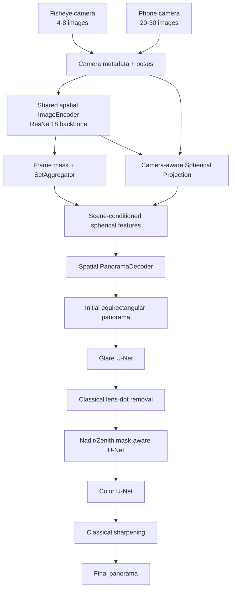
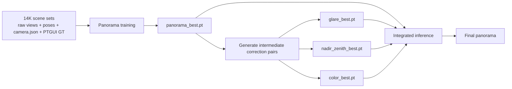

# Capture360 AI Architecture

## Runtime architecture

### Key design rules

1. **One panorama model, variable N.** The model does not assume six images. It supports 4-30 views with padding and a frame mask.
2. **Two camera geometries.** Fisheye uses 180-degree equidistant projection; phone captures use pinhole projection with calibrated intrinsics or a documented FOV-derived fallback.
3. **Shared learned representation.** The image encoder, set aggregator, spherical fusion and panorama decoder are shared across camera types.
4. **Correction models are independent.** Glare, nadir/zenith and color models have separate checkpoints and training jobs.
5. **Classical finishing stays classical.** Lens-dot removal and sharpening are deterministic post-processing, not learned models.
6. **No random correction inference.** Enabled learned correction stages require checkpoints unless explicitly overridden for experimentation.

## Training architecture

The correction models are not trained end-to-end with the panorama model in this architecture. Each stage can be evaluated and replaced independently, then composed in the inference pipeline.

## Repository boundaries

- `Pano_AI/` is the training/research and reference-inference project.
- `app/` is the Android deployment/consumer layer.
- A trained PyTorch checkpoint and exported ONNX model are artifacts, not source-controlled defaults.
