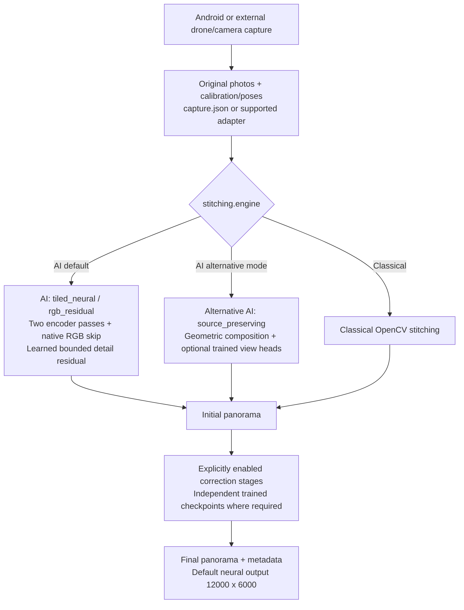

# Capture360 Architecture

Last updated: 2026-10-03. This describes the current Python reference pipeline;
implementation and synthetic execution checks do not establish production quality.
The [detailed panorama architecture](panorama/ARCHITECTURE_VARIABLE_TILED.md)
contains neural tensor shapes, preprocessing, ownership, training and correction diagrams.

## System overview

Capture360 combines an Android guided capture application with a separately
trained Python panorama pipeline. The shared camera contract records original
filenames, image dimensions, intrinsics, camera-to-world rotations, translations
and optional depth. The Python dispatcher selects AI or classical stitching.
The native neural model is not yet an exported Android ONNX graph.

## Default neural architecture

`panorama/stitching/config.yaml` selects `engine: ai`, `mode: tiled_neural` and
`model.detail.mode: rgb_residual`. Input profiles support calibrated fisheye and
pinhole cameras, including drone/mobile inputs whose long edge is at most 3500
and short edge at most 2100, in either orientation. Original larger profile
sizes remain supported; exact profiles take priority during auto selection.

| Component | Current behavior |
| --- | --- |
| Dataset and preprocessing | Original 8-bit RGB source images, calibrated overlap gain estimation, 1024-pixel tiles with 128 overlap; no source super-resolution |
| Encoder | ResNet18 through layer2, stride 8, 64 feature channels; fixed BatchNorm running statistics; optional activation checkpointing |
| Metadata and attention | 21-value tile/camera/rotation embedding; two transformer layers with eight heads; contextual tile gates and a pooled scene token |
| Spherical features | Second streamed encoder pass; tile feathering, normalization within camera, camera footprint feathering; 750x1500 feature canvas |
| Native RGB skip | Per-output-tile camera projection; two-photo CPU cache, cropped transfers, highest-footprint source ownership, coverage and overlap disagreement |
| Neural detail head | 69 input channels (64 features + RGB + coverage + disagreement); Conv/GELU/Conv predicts a bounded RGB residual |
| Decoder output | Native RGB + 0.1 x tanh(residual), clamped and coverage-masked; 1024-pixel output tiles, 64 overlap, two-pixel halos; 12000x6000 RGB |
| Optional correction | Separately trained combined residual U-Net or explicitly enabled separate restoration stages; disabled in the checked-in config |

The zero-initialized final detail layer starts as an identity on sampled source
RGB. It needs training to learn cleanup. Ownership is geometric, not a trained
seam detector, and its residual is an intensity adjustment rather than flow.
Projection uses rotation-only camera geometry. Translation/depth metadata do not
imply depth fusion or automatic correction of moving-object parallax.

Exposure gain estimation is shared across branches and across training/inference.
Feature tiles apply gains in linear light; the current native RGB sampler applies
direct normalized-RGB multiplication/clipping. See the detailed architecture for
this distinction, coordinate conventions and memory limits.

## Training and validation

The native-detail panorama trainer requires original calibrated source views and
aligned, genuine 12000x6000 `panorama.png` references. It renders four 1024-pixel
output crops per scene per epoch at the full 12K scale, preferring source-view
disagreement on half of sampling attempts. Targets at a smaller size are rejected.
L1, local SSIM, perceptual and edge losses supervise the neural model. AdamW,
gradient clipping, optional CUDA AMP and EMA are implemented.

Validation averages up to five fixed corner/centre crops with EMA weights when
configured. These crop metrics do not evaluate the whole 12K output. Panorama
checkpoint selection minimizes the weighted validation objective. Scene splits
must keep all variants of a physical capture location together.

The two-stage job trains `panorama` then `combined` independently. Combined
correction requires separate reviewed before/after panorama pairs; those pairs
alone cannot train camera-aware stitching. Training does not automatically create
correction labels from panorama predictions or jointly optimize both models.
The [training guide](panorama/pano_ai/README.md) documents data layouts and commands.

## Checkpoints, inference and outputs

The default neural contract is `panorama_native_rgb_residual_v6`, with
`panorama_native_detail_best.pt` and `panorama_native_detail_last.pt` checkpoint
names. Explicit `model.detail.mode: features` retains the legacy
`panorama_exposure_blending_v4` architecture. Inference rejects architecture or
native residual-scale mismatches even when legacy comparison is enabled;
exposure configuration and strict weight loading must also match.

`tiled_inference.py` loads the compatible model/EMA state, runs neural stitching,
saves initial RGB, and runs enabled post-stitch corrections. It writes PNG,
lossless 8-bit RGB TIFF and metadata including detail mode, contracts, dimensions,
weights and exposure diagnostics. No classical RGB stitcher runs in default
`tiled_neural` mode. The alternative `source_preserving` route uses the existing
geometric compositor and optional separately trained alignment/ownership heads.

Combined correction uses a residual U-Net with independent weights and requires
exclusive activation among post-blend correction toggles. Separate masked stages
require aligned defect masks; pairwise post-blend seam/overlap/flow toggles are
unsupported in the tiled correction pipeline. There is no automatic person
detector or guaranteed recovery of hidden surfaces.

## Resolution and deployment limits

Native RGB detail bypasses the coarse feature canvas at final output coordinates,
but 12K dimensions cannot establish recovered texture or motion blur removal.
The alternative geometric/calibrated classical compositor retains its 4096-pixel
working-width cap and enlarges larger exports. Hard ownership can expose seams;
real-scene validation is required after neural retraining.

Tiling bounds individual warps and decoder patches, not all memory. Full 12K
float32 RGB and weight accumulators alone use about 1.15 GB, plus feature canvases,
encoder inputs, attention and intermediates. Training keeps the reference on CPU
and transfers the selected target crop. GPU memory and latency require measurement
on the intended hardware. The export module emits Python runtime-contract notes,
not a deployable native-tiled ONNX model.

## Module and documentation map

| Location | Purpose |
| --- | --- |
| `app/` | Android capture application and its capture/stitch/persist shell |
| `panorama/stitching/` | Camera contract, input profiles, YAML configuration, dispatcher and visual regression |
| `panorama/pano_ai/` | Neural architecture, original-resolution inputs, training, inference and restoration |
| `panorama/pano_classical/` | OpenCV/calibrated geometric stitching and classical finishing |
| [Detailed neural diagrams](panorama/ARCHITECTURE_VARIABLE_TILED.md) | Current architecture, tensor shapes, training and alternatives |
| [AI README](panorama/pano_ai/README.md) | Dataset preparation, migration, training and inference steps |
| [Testing guide](panorama/stitching/TESTING.md#neural-native-detail-validation) | Regression commands, 12K output checks and held-out visual review |

Synthetic tests verify texture identity, source ownership, periodic projection,
learned tile/crop consistency, gradients, checkpoint/EMA reload and incompatibility
rejection. The 12K test renders a crop on that coordinate lattice; it does not
establish real drone/mobile quality or full-size GPU resource use.
