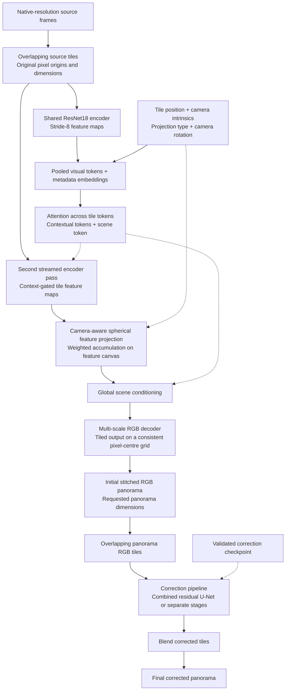
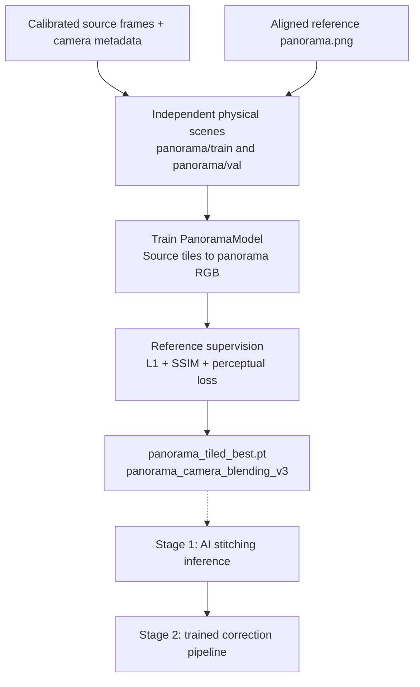
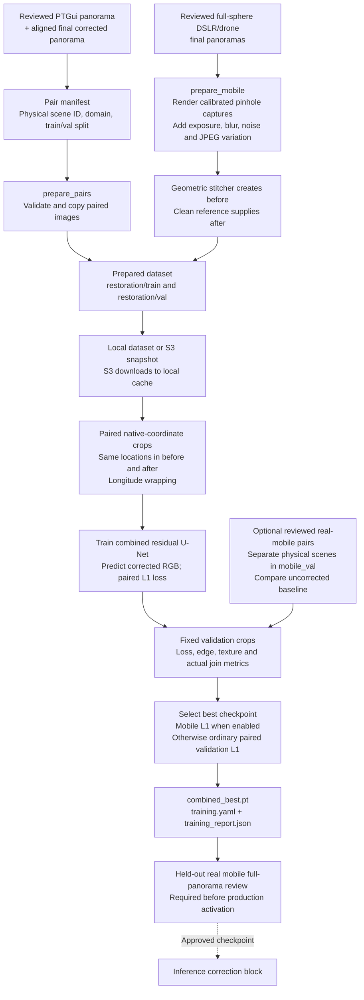
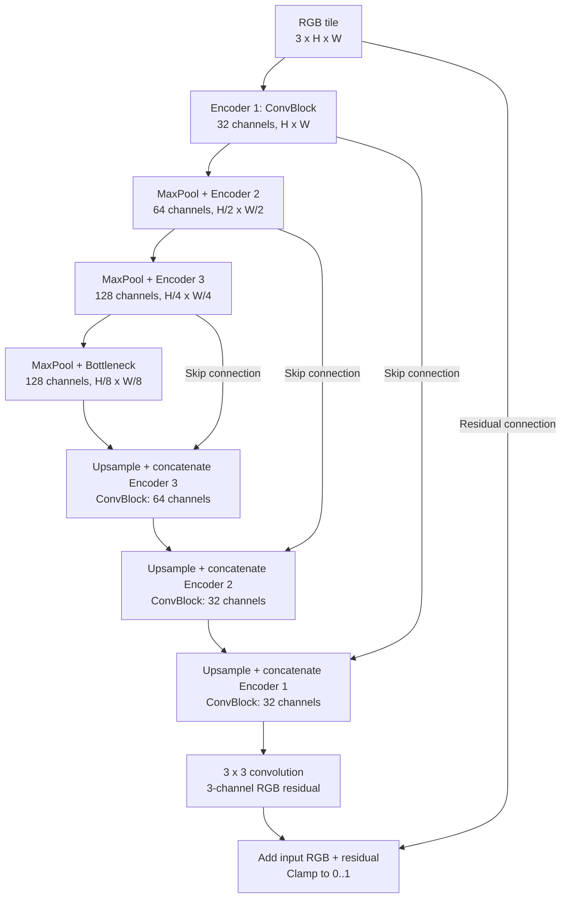
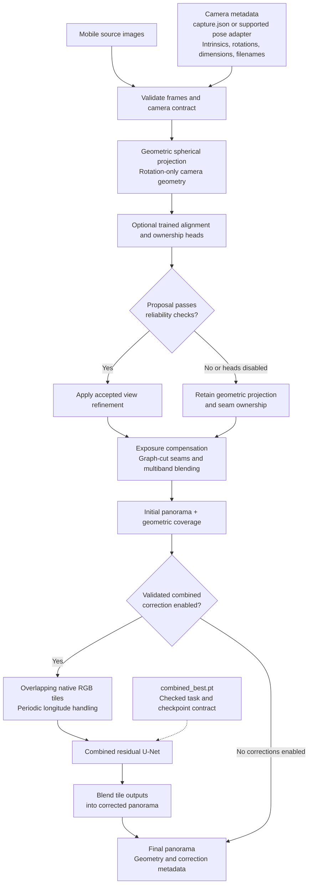

# Capture360 panorama architecture

The primary workflow runs a trained **AI stitching model** first, followed by
the **correction pipeline**. AI stitching consumes calibrated source images and
produces an initial panorama; combined correction consumes that panorama as RGB
tiles. The two models require separate supervision and checkpoints. The neural
stitcher still needs held-out quality validation before production use.

See [the training guide](pano_ai/README.md) for data preparation and commands.
Diagrams below use Mermaid; open Markdown preview in a renderer with Mermaid support.
Solid arrows carry data; dotted arrows supply configuration, weights or supervision.

## 1. AI stitching first, then correction

This is the default `ai_pipeline.mode: tiled_neural`, implemented by
[PanoramaModel](pano_ai/models/panorama_model.py). The stitching model has a separate training route
requiring calibrated source images and aligned reference panoramas; training
`combined` does not train this decoder. Corrected coordinate conventions require
compatible `panorama_camera_blending_v3` checkpoints.

Streaming limits feature-map memory, but attention still operates over the tile
tokens. Variable frame counts and tiled decoding do not imply unlimited memory
or validated quality at arbitrary capture counts.

The execution order is implemented in [tiled_inference.py](pano_ai/tiled_inference.py):
`PanoramaModel.forward_scene` produces `initial_panorama`, then
`HighResolutionCorrectionPipeline.run` produces the final panorama.
No classical RGB stitcher runs before the neural model in this mode.
Camera-aware projection inside the model combines features from the source views.

Train both stages with [stitching_correction_job.yaml](pano_ai/train/configs/stitching_correction_job.yaml),
which selects `tasks: [panorama, combined]`. This trains two models sequentially,
rather than a single end-to-end model. Set `inference.checkpoint` to the trained
panorama checkpoint and `correction.checkpoints.combined` to the trained
correction checkpoint. Enable `correction.toggles.combined` after validation.
With correction toggles disabled, the pipeline returns the initial neural panorama.

## 2. Data preparation, training and validation

AI stitching training is the first task in the two-stage training job:

The correction dataset and training are separate, as shown below. PTGui pairs
provide correction supervision; they do not supply calibrated stitching scenes.

All variants of a physical scene stay in one split. Real mobile validation scenes
must also be separate from ordinary validation. Synthetic mobile examples are
labelled `synthetic_mobile` and cannot replace a real mobile benchmark.
Synthetic generation simulates rotation and appearance changes, not translation
parallax, hidden surfaces, rolling shutter or real moving people.

The correction-only job selects `tasks: [combined]` in
[training_job.yaml](pano_ai/train/configs/training_job.yaml). This route needs
aligned before/after panoramas, not per-stage displacement, ownership or defect
mask labels. Optional alignment/blending heads require separate labelled data
and are not trained by this job. Checkpoint selection can explicitly override
the default with `combined.checkpoint_selection`.

## 3. Combined correction model: residual U-Net

Channel counts show the default `base_channels: 32`. Each ConvBlock contains two
3x3 convolutions with GroupNorm and SiLU. Upsampling is bilinear to the matching
encoder size. The implementation is
[CombinedRestorationUNet](pano_ai/models/combined_restoration.py) using
[RestorationUNet](pano_ai/models/restoration_backbone.py).
Training uses native paired crops; inference processes overlapping tiles and
blends their outputs. The default training crop is 1024x1024. No mask input is
required for this combined model, and exact preservation of unchanged regions
is not guaranteed.

## 4. Alternative: source-preserving geometric stitching

This diagram shows `ai_pipeline.mode: source_preserving` in
[config.yaml](stitching/config.yaml), implemented by
[source_inference.py](pano_ai/source_inference.py). Learned view heads are optional
and disabled by default. Their gates check confidence, displacement, consistency,
Jacobian bounds, textured overlap and photometric improvement; rejected proposals
retain the geometric result.

The calibrated classical path shares the camera contract and geometric compositor.
Mobile inference needs source frames and calibration/poses for this route, but
**does not need a corrected reference panorama**. Images alone do not supply the
camera contract automatically in this path.

Combined correction must be enabled alone among post-blend correction toggles.
The alternative separate-stage route uses explicit defect masks for masked
repairs; combined correction takes RGB only and can change any pixel. Neither
route includes an automatic person detector. Keep learned correction disabled
until real mobile evaluation supports enabling it.

## Resolution and quality limits

The requested output may be 12000x6000. In the alternative geometric route, the compositor
works at at most 4096 pixels wide and enlarges larger outputs. A 12K file therefore
does not establish native 12K detail. The AI stitching decoder uses a smaller
spherical feature canvas; output dimensions alone cannot restore lost texture.

Translations and optional depth are retained in the shared camera format, but
current composition uses rotation-only geometry. Strong nearby parallax, missing
coverage and hidden floor remain limitations. Synthetic smoke tests verify
execution and contracts; they do not demonstrate real mobile quality or parity
with a commercial panorama system.
