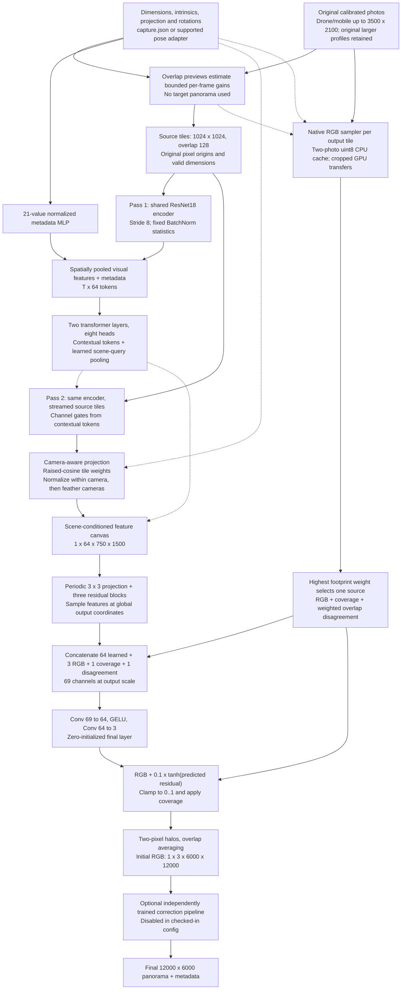
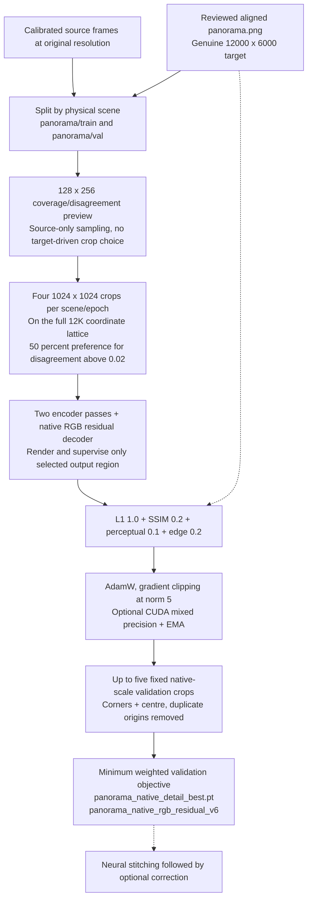
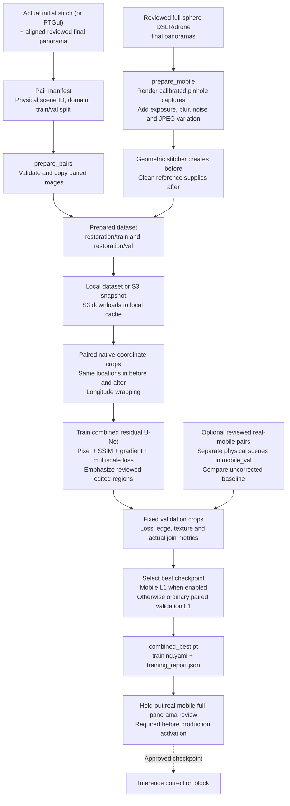
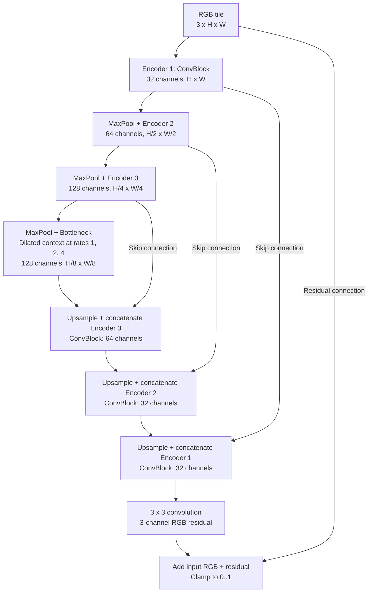
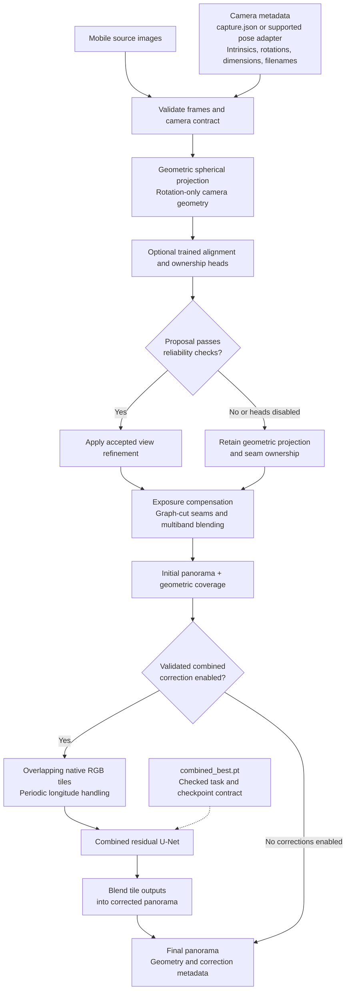

# Capture360 panorama architecture

The primary workflow runs a trained **AI stitching model** first, followed by
the **correction pipeline**. AI stitching consumes calibrated source images and
produces an initial panorama; combined correction consumes that panorama as RGB
tiles. The two models require separate supervision and checkpoints. The neural
stitcher still needs held-out quality validation before production use.

See [the training guide](pano_ai/README.md) for data preparation and commands.
Diagrams below use Mermaid; open Markdown preview in a renderer with Mermaid support.
Solid arrows carry data; dotted arrows supply configuration, weights or supervision.

## 1. Neural stitching with native RGB detail

The checked-in route is `stitching.engine: ai`, `ai_pipeline.mode: tiled_neural`,
and `model.detail.mode: rgb_residual`. It uses [PanoramaModel](pano_ai/models/panorama_model.py)
and [NativeRGBSource](pano_ai/data/native_rgb.py); it does not invoke a classical
RGB stitcher. Batch size is one scene, with a variable number of source tiles.
Tensor shapes below use `[batch, channels, height, width]` unless stated otherwise.



### Preprocessing and the two encoder passes

1. `VariableTilePanoramaDataset` loads the shared capture contract, checks source
   dimensions against calibration, validates the selected profile/frame count,
   and retains original image sizes. No whole-source resize or super-resolution
   preprocessing is applied. Input images are decoded as 8-bit RGB.
2. Canonical OpenGL rotations are converted to the internal computer-vision
   convention by `CV_BASIS @ rotation @ CV_BASIS`. Neural projection uses camera
   axes right/down/forward. Translation and depth are retained as metadata but
   are not used for this projection.
3. `estimate_exposure` uses calibrated overlap previews (512 pixels wide by
   default), rejects unreliable/dark/clipped overlaps and estimates bounded
   scalar gains. Isolated views keep unity gains. Both branches reuse these
   estimates in training and inference. Feature tiles apply gains in linear
   light through `apply_exposure`; the native RGB sampler uses the same transfer
   function.
4. `iter_tile_batches` yields native 1024-pixel crops with 128-pixel overlap and
   pads short crops. The encoder applies ImageNet mean/std normalization and
   ResNet18 through `layer2`, followed by a 128-to-64 projection. A default tile
   produces `[K,64,128,128]` features. BatchNorm running statistics stay fixed;
   affine parameters remain trainable. Optional activation checkpointing applies
   during training, not inference.
5. Pass 1 pools spatial features and adds a metadata embedding: normalized tile
   origin/size, normalized image size, six camera values and nine rotation values
   (21 values total). Transformer layers contextualize all tile tokens. A learned
   query pools the scene token; tile count still determines attention memory.
6. Pass 2 re-encodes the same contiguous per-camera tile stream. Contextual
   sigmoid channel gates modulate each tile. Tiles project into the spherical
   feature canvas with continuous feather weights, normalize within each camera,
   then combine using camera footprint weights. A learned scene gate conditions
   the resulting features. Repeated chunks for a finished camera are rejected.

### Native RGB ownership and learned residuals

`NativeRGBSource` computes camera coordinates for the requested tile plus its
halo in float32. It caches at most two original CPU uint8 photos by default,
transfers each needed source rectangle, and bilinearly samples it with
`grid_sample`. Longitude is periodic and pole coordinates are clamped.

For each observed pixel, the greatest camera footprint weight chooses its RGB.
This is deterministic geometric ownership, not a trained seam classifier;
weight ties retain the first frame. The footprint weight feathers camera edges
and reflects valid projection. The sampler also computes binary coverage and
`sqrt(mean_channels(clamp(weighted_second_moment - weighted_mean_squared, min=0)))`
as a scalar overlap-disagreement signal. This measures appearance
variation, not a calibrated confidence or a ground-truth motion label.
Source sampling runs without gradients; the refinement head and scene-feature
branch remain trainable.

The decoder first refines the 64-channel coarse canvas with longitude-periodic
convolutions. At output scale it concatenates features, native RGB, coverage and
disagreement, then applies two 3x3 convolutions with GELU between them:

```text
residual = residual_scale * tanh(detail_head(concatenated_inputs))
output   = clamp(native_rgb + residual, 0, 1) * coverage
```

`residual_scale` defaults to 0.1 in normalized RGB and must be in `(0,1]`.
The final convolution is zero-initialized, so the untrained head preserves the
sampled RGB base; it is not a trained enhancement model. The residual limit
bounds intensity changes, not geometric displacement. Unobserved pixels remain
black before optional masked correction.

Output tiles default to 1024 with 64-pixel overlap and a two-pixel context halo
covering the detail convolutions. Global pixel-centre coordinates keep sampling
independent of tile/crop size. Tile predictions are accumulated in float32 and
averaged by contribution count, then converted once to 8-bit RGB for output.
Training may request a `(top,left,height,width)` region on the same full-size
coordinate grid without allocating a full high-resolution decoder output.

### Runtime and checkpoint separation

[tiled_inference.py](pano_ai/tiled_inference.py) validates the capture, loads the
panorama checkpoint (EMA when available/requested), runs `forward_scene`, saves
the initial panorama, then invokes `HighResolutionCorrectionPipeline`.
The default native-detail checkpoint is `panorama_native_detail_best.pt` with
contract `panorama_native_rgb_residual_v6`. Training `combined` alone does not
train this neural stitcher. The two-stage job trains both independently; it does
not backpropagate correction loss into the panorama model or generate correction
pairs automatically. With correction toggles disabled, the final RGB equals the
initial neural panorama.

| Detail mode | RGB construction | Contract | Compatibility |
| --- | --- | --- | --- |
| `rgb_residual` (config default) | Native source RGB plus learned bounded residual | `panorama_native_rgb_residual_v6` | Requires newly trained weights |
| `features` (explicit legacy mode) | Sigmoid RGB reconstructed from sampled coarse features | `panorama_exposure_blending_v4` | Existing matching v4 weights |

Model constructors retain `features` as their default for old programmatic
callers; the YAML-driven trainer/inference explicitly supplies `rgb_residual`.
Detail-mode or native residual-scale mismatches are rejected before weight
loading, even with `allow_legacy_checkpoint`. Matching exposure settings and
strict state-dictionary loading are also required. The legacy flag is only for
intentional same-architecture contract comparisons; it cannot create missing
weights for the new head.

## 2. Data preparation, training and validation



The default training and inference dimensions are both 6000x12000 (height x
width). Native-detail targets must exactly match the training output dimensions;
the trainer rejects smaller targets instead of upscaling them. It cannot detect
whether an externally upscaled image is truly high-quality supervision, so
reference provenance and visual review remain necessary.

Training uses a source-only preview of at most 128x256, selects an observed pixel,
and centres/clips a native crop around it. With `seam_crop_probability: 0.5`, it
prefers observed pixels whose disagreement exceeds 0.02, falling back to observed
coverage if none qualify. These are disagreement-focused crops, not annotated
seam masks. `native_crops_per_scene: 4` performs four independent optimizer steps
per scene per epoch. The feature encoder still processes the full source scene
for each crop; output crop training does not crop away scene context.

Panorama loss is weighted L1, local-window SSIM loss, optional pretrained
ResNet18 perceptual feature L1 and horizontal/vertical adjacent-pixel gradient L1.
Perceptual inputs are bounded to 512x1024; edge and pixel terms operate on the
native crop. Nonzero geometry loss weights are rejected because no geometry
prediction is supervised. AdamW defaults to learning rate 5e-5 and weight decay
1e-4. CUDA AMP is optional, gradients are clipped to norm 5, and EMA updates only
after successful optimizer steps. Pretrained encoder/perceptual weights require
a download if they are not already cached.

Validation uses top-left, top-right, bottom-left, bottom-right and centre crops,
removing duplicate origins. It does not use training randomness or target-driven
crop selection. Metrics average crop loss, L1, PSNR, global SSIM proxy and pixel
accuracy (all RGB errors <=8/255), with EMA weights when enabled. These are crop
metrics, not a complete 12K panorama benchmark. Best checkpoint selection uses
the weighted validation loss, or training loss if no validation dataset exists;
prepare an independent validation split for quality decisions. Checkpoints store
model, optimizer, EMA, epoch, effective config, contract and metrics. Panorama
resume/fine-tuning is not implemented by the job runner.

The standalone trainer is [train_tiled.py](pano_ai/train_tiled.py). The two-stage
[stitching_correction_job.yaml](pano_ai/train/configs/stitching_correction_job.yaml)
uses `tasks: [panorama, combined]`. Both calibrated panorama scenes and separate
reviewed restoration pairs must exist. The pair packager supplies restoration
pairs only; it does not infer camera calibration or produce stitching labels.

The correction dataset and training are separate, as shown below. Use actual
initial stitching outputs paired with reviewed final panoramas to match deployed
defects. PTGui pairs can also supply correction supervision; neither supplies
calibrated stitching scenes on its own.



All variants of a physical scene stay in one split. Real mobile validation scenes
must also be separate from ordinary validation. Synthetic mobile examples are
labelled `synthetic_mobile` and cannot replace a real mobile benchmark.
Synthetic generation simulates rotation and appearance changes, not translation
parallax, hidden surfaces, rolling shutter or real moving people.

The correction-only job selects `tasks: [combined]` in
[training_job.yaml](pano_ai/train/configs/training_job.yaml). This route needs
aligned before/after panoramas, not per-stage displacement, ownership or defect
mask labels. Optional alignment/blending heads require separate labelled data
and are not trained by this job. Checkpoint selection can explicitly override
the default with `combined.checkpoint_selection`.

## 3. Combined correction model: residual U-Net



Channel counts show the default `base_channels: 32`. Each ConvBlock contains two
3x3 convolutions with SiLU and no spatial normalization in v2. Upsampling is bilinear to the matching
encoder size. The implementation is
[CombinedRestorationUNet](pano_ai/models/combined_restoration.py) using
[RestorationUNet](pano_ai/models/restoration_backbone.py).
Training uses native paired crops; inference processes overlapping tiles and
uses 160-pixel context halos on a shared pooling lattice, and blends floating-point
outputs before quantization. The RGB residual head starts at zero (identity).
The default training crop is 1024x1024. No mask input is
required for this combined model, and exact preservation of unchanged regions
is not guaranteed.

Half the training crops target local reviewed edits, with global color offsets
removed from the sampling map; validation uses fixed target-independent crops.
Training weights edited regions more strongly and combines L1, local SSIM,
gradient and multiscale terms. Validation reports unchanged-input baselines and
selects checkpoints by plain held-out L1. V2 has its own checkpoint contract;
existing v1 checkpoints load through the original architecture for inference.

## 4. Alternative: source-preserving geometric stitching



This diagram shows `ai_pipeline.mode: source_preserving` in
[config.yaml](stitching/config.yaml), implemented by
[source_inference.py](pano_ai/source_inference.py). Learned view heads are optional
and disabled by default. Their gates check confidence, displacement, consistency,
Jacobian bounds, textured overlap and photometric improvement; rejected proposals
retain the geometric result.

The calibrated classical path shares the camera contract and geometric compositor.
Mobile inference needs source frames and calibration/poses for this route, but
**does not need a corrected reference panorama**. Images alone do not supply the
camera contract automatically in this path.

Combined correction must be enabled alone among post-blend correction toggles.
The alternative separate-stage route uses explicit defect masks for masked
repairs; combined correction takes RGB only and can change any pixel. Neither
route includes an automatic person detector. Keep learned correction disabled
until real mobile evaluation supports enabling it.

## Resolution, memory and quality limits

The default neural RGB skip samples original photos directly onto 12000x6000
coordinates. Its learned scene features are still 750x1500, but final RGB detail
can bypass that coarse representation. Export size is not evidence that input
blur or absent detail has been recovered. Hard source ownership can expose
geometric/tonal discontinuities; residual cleanup needs reviewed supervision.
Neither RGB ownership nor the residual head estimates depth or solves translation
parallax, rolling shutter or moving-object geometry.

The alternative `source_preserving` and calibrated classical compositor still
work at at most 4096 pixels wide and enlarge larger requested outputs. The new
neural detail path does not change that compositor or invoke it.

Tiling bounds individual decoder feature tiles, native RGB projections and crop
training outputs, not all memory. Full neural inference allocates float32 RGB
accumulation and weight buffers (about 1.15 GB at 12K), plus coarse feature canvases,
encoder batches, attention tokens and intermediate tensors. The dataset loads a
full float reference panorama on CPU during training; crops limit GPU target/output
allocation. Source rectangles may span most of a photo. The bounded two-photo
CPU cache can require repeated decoding when cameras are revisited. Activation
checkpointing saves encoder activations at additional compute cost; it does not
remove input-tile, attention or coarse-canvas costs. Measure production GPU memory
and latency; no fixed memory or speed guarantee has been established.

Synthetic tests check identity texture, conflict ownership, disagreement, periodic
projection, tile/crop consistency, trainable gradients, target dimensions,
checkpoint/EMA reload and incompatible-architecture rejection. A test renders a
crop at actual 12K coordinates; it is not a full-12K GPU quality benchmark. See
[testing instructions](stitching/TESTING.md#neural-native-detail-validation) for
commands and held-out visual comparison.

## Implementation map

| File | Responsibility |
| --- | --- |
| `stitching/capture.py`, `stitching/profiles.py` | Calibration adapters, dimensions, profiles and frame-count validation |
| `pano_ai/data/tile_dataset.py`, `data/tiling.py` | Native source chunks, crop padding, scene references |
| `pano_ai/data/exposure.py` | Source-only overlap gain estimation and feature-branch gain application |
| `pano_ai/models/encoder.py` | ResNet18 stride-8 features, fixed BatchNorm, optional activation checkpointing |
| `pano_ai/models/tile_metadata.py`, `models/tile_aggregator.py` | Geometry embeddings, contextual tile tokens and scene pooling |
| `pano_ai/models/tile_spherical.py` | Global/region camera projection, float32 coordinates and feature fusion contracts |
| `pano_ai/data/native_rgb.py` | Native RGB skip, hard ownership, coverage and disagreement |
| `pano_ai/models/decoder.py`, `models/panorama_model.py` | Learned residual detail, periodic tiles and scene orchestration |
| `pano_ai/train_tiled.py`, `train/panorama_loss.py` | Native crop optimization, edge loss, validation and v6 checkpoint saving |
| `pano_ai/tiled_inference.py` | Checkpoint guards, neural stitching, corrections and output metadata |
| `pano_ai/highres_correction.py`, `models/combined_restoration.py` | Independent post-stitch restoration |
